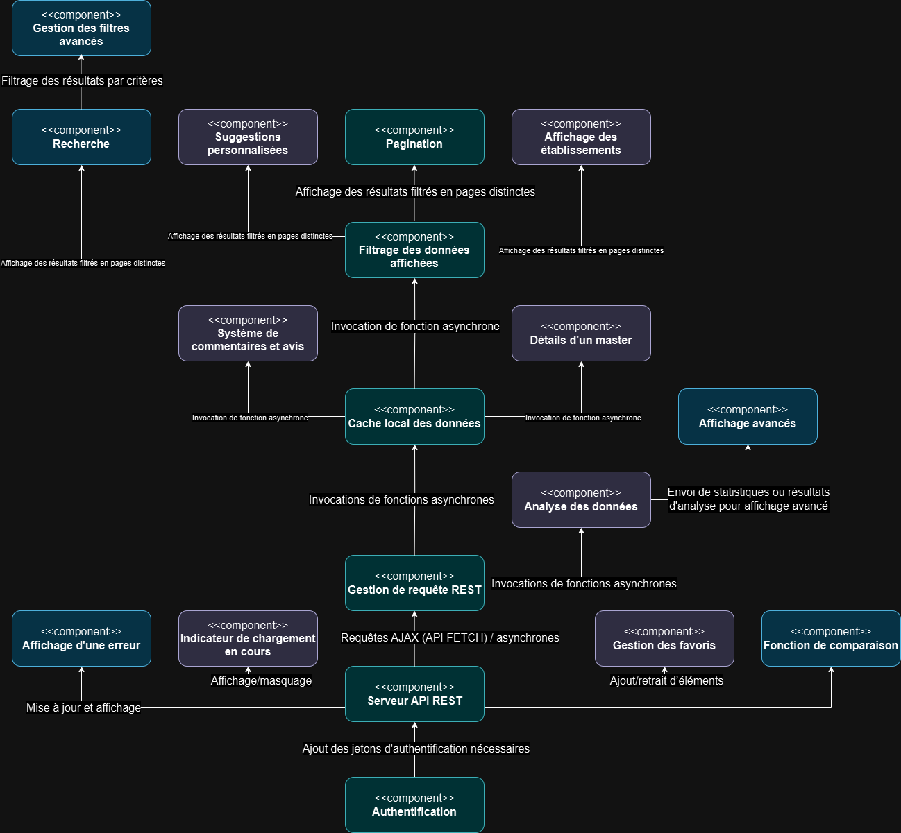

# Documentation Administrateur

## Objectif : Passation à une équipe de dev et la tierce maintenance
Il faut :
- Un code bien documenté.
- Une architecture claire.
- Des guides pour la compréhension rapide du fonctionnement.

---

## Présentation Technique
### Technologies utilisées :
- **Langages utilisés** : HTML, CSS, JS, SQL (PHP dans l’avenir)
- **Frameworks** : Tailwind
- **Bibliothèque JavaScript** : ECharts

---

## Guide de Déploiement
### Les prérequis :
- **Système d’exploitation** : Windows, Mac OS, Linux
- **Logiciels** : Visual Studio Code, un navigateur web, Git, PHP
- **Autres** : Un ordinateur, un compte GitHub, une connexion internet

### Les étapes d’installation :
1. Ouvrir Visual Studio Code.
2. Connexion avec le dépôt GitHub.
3. Récupérer les dernières versions des fichiers avec `git pull`.

### Les tests nécessaires avant la mise en production :
- Tester si le site fonctionne bien et s’il n’y a pas de bugs apparents.

---

## Modèles de Données et Composants
### Modèle de données :

### Diagramme de composants :

---

## Roadmap Prévisionnelle
| Étape                   | État                  |
|-------------------------|-----------------------|
| Burger menu             | Fini                  |
| Mise en favoris         | Partie front uniquement |
| Fonctionnalité de recherche | Fini              |
| Gestion de compte       | Partie front uniquement |
| Affichage de graphique via echart  | Fini         |
| Icone de chargement     | Pas fait         |

- **Priorités et dépendances** : *(à détailler)*

---

## Bug Tracking
### Liste des bugs identifiés :
| Numéro du bug | État           | Description                              |
|---------------|----------------|------------------------------------------|
| 1             | Corrigé        | La barre de navigation ne s’adapte pas à la taille de la page |
| 2             | Corrigé        | Suppression des éléments ayant comme valeurs 'null' pour la catégorie "parcours"|
| 3             | Corrigé        | Optimisation du chargement des masters pour éviter des bugs d'affichage liés au chargement|
| 4             | Pas corrigé    | La mise en gras du nom de la page sélectionnée dans la barre de navigation ne se met pas à jour au changement de page |
| 5             | Pas corrigé    | Latence au chargement des données de l'API (API surchargée) |
| 6             | Pas corrigé    | Contraste invalide des icones des éléments dans le burger menu |
| 7             | Pas corrigé    | La croix du burger menu n'apparait pas lorsque le burger menu est ouvert |
| 8             | Pas corrigé    | Le texte d'indication au survol des graphique à gauche de l'écran est partiellement masquer|
